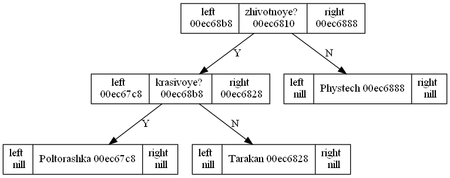

# Akinator

This program is free-to-use for all kinds of developers.

***
## What does the project do 
It is a small version of "Akinator" browser game, which asks you questions trying to indetify an object that was guessed.

***
## Why is the project useful
Despite the fact that writing such a program might be entertaining and even funny because of its functionality, 
it also allows to work with fundamental data structure which is binary tree, because the implementation is based
on it.

***
## Structure
The program is to be interacted with by a command line. By the way, some of its functions demand usage of third-party 
programs such as [graphviz](https://graphviz.org/).

***
## Functionality
When you launch the program, it asks you about the mode you want to use. Here are they:

1. Allows to play the game. Akinator might guess your object or not (after some unsuccessful attempts it will surrender).
2. Allows to compare two objects that are already in database (it will enumerate all their characteristics showing
   differences between objects).
3. Allows to receive a complete definition of an object from database (enumerating all its characteristics).
4. Builds a scheme (a tree) where all objects and questions that exist in database are shown. The picture is called "AkinatorImg.png".

If the program have not guessed your object, it will ask you to add the unknown object to the database. You are to name the object and
give the quality that distinguishes it from considered one. __IMPORTANT!__ You should name the quality which __OBJECT THAT IS ADDED 
POSESS__.

***
## Database
Database is a .txt file which contains all objects that the program is able to identify; all questions that exist can be also found there.

The string with data should always begin with the symbol '{' and end with '}'. All data is kept in a form of a binary tree:
when we want go to the left descendant of a node, we use symbol '{'. If some information (string) is contained in a node then its name 
should be:
1. Between '{' and '}' symbols that relate to this node (because we use in-order tree traversal);
2. Between '|' and '|' symbols that surround string in order to facilitate the process of reading information from nodes.
So we place '}' symbol when we return to the node from its left descendant during in-order traversal. __IMPORTANT!__ No spaces or 
another symbols are allowed between those technical symbols, otherwise database will be corrupted. Following these rules, it is 
possible to make changes in database even straightforward.

Example of database: if string looks like _{|zhivotnoye?|{|krasivoye?|{|Poltorashka|}{|Tarakan|}}{|Phystech|}}_, then
its graph dump looks like .

Each time before you want to exit program it will ask you whether you want to save updated database. If yes, it will be rewrited,
otherwise nothing will be changed.

***
## How can I help
I explicitly welcome any outside contributors. Use my mail: _ilichev.kv@phystech.edu_.

__A strong request__:
* Do not break the codestyle
* Do not destroy previous functionality with additions

***
## Where to ask questions
Use the mail mentioned earlier.

   
